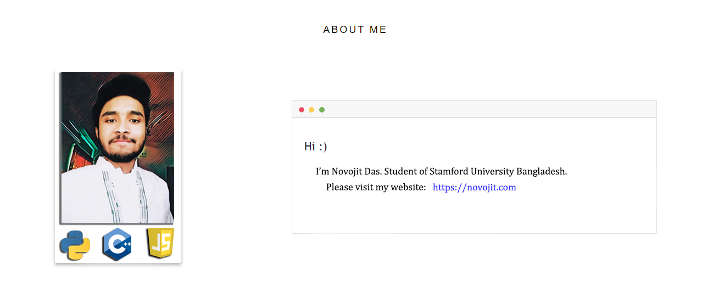

<!--
**novojitdas/novojitdas** is a ✨ _special_ ✨ repository because its `README.md` (this file) appears on your GitHub profile .

Here are some ideas to get you started:

- 🔭 I’m currently working on ...
- 🌱 I’m currently learning ...
- 👯 I’m looking to collaborate on ...
- 🤔 I’m looking for help with ...
- 💬 Ask me about ...
- 📫 How to reach me: ...
- 😄 Pronouns: ...
- ⚡ Fun fact: ...
-->

<!--

--> 

  
  
  
  
  
  
  

  

### :trophy: GITHUB PROFILE TROPHY

### :e-mail: CONTACT WITH ME

### :computer: MY CP WEBSITE PROFILES

  

